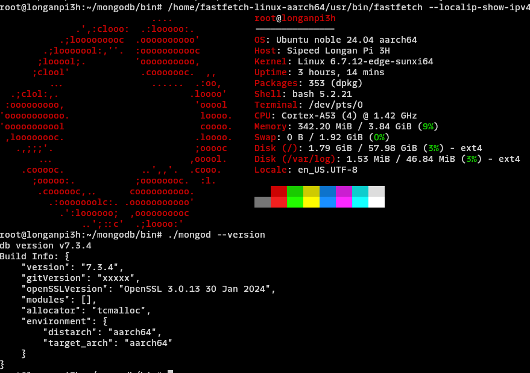

# monogodb server for aarch64 (armv8) [cortex A53, cortex A55]

## For version 7.xx

This repo helps you to cross-compile mongodb for ISA armv8 using x86 Desktop/Server host machine.

we use chroot and debootstrap to prepare rootfs of arm64 ubuntu jammy (22.04), during this phase we also install mongodb's target side build dependency packages
`libssl-dev, libcurl4-openssl-dev`

then we pass this rootfs to gcc as system root which should be enough to finish the cross-build smoothly.

## Host (x86) side preparations

- Install the tools
  ```shell
  sudo apt update && sudo apt install qemu-system-misc qemu-user-static binfmt-support\
  fakeroot fakechroot chroot debootstrap
  ```
- Prepare the rootfs for Ubuntu jammy
  ```shell
  # Usage: ./prepare-rootfs.bash <arch> <linux_suite> <cache_dir> <output_dir>
  ./prepare-rootfs.sh arm64 jammy cache fs
  export ROOTFS_DIR=$PWD/rootfs/fs/arm64/jammy
  ```
- Prepare mongodb
  ```shell
  wget https://github.com/mongodb/mongo/archive/refs/tags/r7.3.4-rc2.tar.gz &&\
  tar -xf r7.3.4-rc2.tar.gz && cd mongo-r7.3.4-rc2

  # do the python virtual environment setup and poetry setup as per
  # https://github.com/mongodb/mongo/blob/master/docs/building.md

  # I used pyenv based python installation, so here is how I did.
  pyenv virtualenv 3.10.14 mongo-build-v7
  pyenv activate mongo-build-v7
  python -m pip install poetry
  PIP_USE_PEP517=1 PYTHON_KEYRING_BACKEND=keyring.backends.null.Keyring poetry install --no-root --sync
  ```

### Build, release profile

Configure the build and generate Ninja files
```
buildscripts/scons.py\
 CC=aarch64-linux-gnu-gcc\
 CXX=aarch64-linux-gnu-g++\
 CCFLAGS='-march=armv8-a+crc -mtune=cortex-a53 --sysroot=$ROOTFS_DIR'\
 LINKFLAGS='-march=armv8-a+crc -mtune=cortex-a53 --sysroot=$ROOTFS_DIR'\
 NINJA_PREFIX=release\
 VARIANT_DIR=release\
 --linker=gold\
 --disable-warnings-as-errors\
 --release\
 --ninja=enabled\
 --link-model=static\
 --opt=on\
 --separate-debug
```

Do the Ninja build
```
ninja -g release.ninja -j0 install-mongod
```

### Configuring mongod
- https://www.mongodb.com/docs/manual/administration/configuration/#std-label-base-config
- https://www.mongodb.com/docs/manual/reference/configuration-options/

#### Sample config
mongod.conf
```yaml
processManagement:
  # run in daemon mode
  fork: true
  pidFilePath: /var/run/mongod.pid
  timeZoneInfo: /usr/share/zoneinfo
net:
   bindIp: 0.0.0.0
   port: 27017
storage:
  # TODO: change the dbPath
  dbPath: /home/data
  directoryPerDB: true
  wiredTiger:
    engineConfig:
        # TODO: change the cache size as per your SBC spec
        cacheSizeGB: 1
systemLog:
   destination: file
   path: "/var/log/mongodb/mongod.log"
   logAppend: true
```

## pre-built binaries for longan-pi3h, raspberrypi 3 & 4, Nanopi Neo2
- [mongodb-v7.3.4-aarch64.txz](https://github.com/123swk123/mongodb-armv8-a/releases/download/v7.3.4-alpha/mongodb-v7.3.4-aarch64.txz)

### Tested on longan-pi3h


## Mongodb community on aarch64 (ISA: armv8)
- [Core dump on MongoDB 5.0 on RPi 4](https://www.mongodb.com/community/forums/t/core-dump-on-mongodb-5-0-on-rpi-4/115291)
- [Build advice for arm64/aarch64?](https://www.mongodb.com/community/forums/t/build-advice-for-arm64-aarch64/16736)
- [Add MongoDB 4.2 ARM64 builds for Raspberry Pi OS 64 bit (Debian Buster)](https://www.mongodb.com/community/forums/t/add-mongodb-4-2-arm64-builds-for-raspberry-pi-os-64-bit-debian-buster/5046)

## Random notes
### How to get various build options?
- look for 'add_option' or 'get_option\(.*\)' in SConstruct
- various build profiles in `site_scons/mongo/build_profiles.py`
- potential options, yet to play with
	- --thin-lto
	- --experimental-optimization=O3 # gcc -O3 optimization
	- --server-js=off # disable java script support
	- --ssl=off # turn off SSL, this is creating link error
 	- --variables_files='./etc/scons/developer_versions.vars' # uses git describe to prepare the version string

## TODO
### ssl=off link errors
```
Linking build/opt/mongo/db/mongod
src/mongo/db/client.h:191: error: undefined reference to 'mongo::SSLPeerInfo::forSession(std::shared_ptr<mongo::transport::Session> const&)'
src/mongo/db/client.h:191: error: undefined reference to 'mongo::SSLPeerInfo::forSession(std::shared_ptr<mongo::transport::Session> const&)'
collect2: error: ld returned 1 exit status
scons: *** [build/opt/mongo/db/mongod] Error 1
scons: building terminated because of errors.
```
